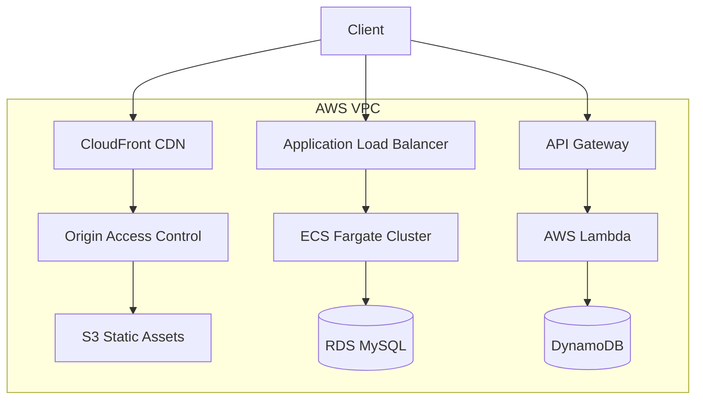

# Terraform AWS Multi-Environment Platform

[](https://github.com/adeliusa486/terraform-aws-multi-env-platform/actions/workflows/validation.yml)

## Project Overview

This repository contains Infrastructure as Code (IaC) to provision a multi-environment AWS architecture using Terraform and Terragrunt. The system provides an isolated network topology, containerized compute resources, relational data storage, and a global content delivery network.

## Architecture



The infrastructure uses Terraform to provision the network, compute, security, and monitoring resources. Public traffic enters through the load balancer and CDN, while application resources and databases remain strictly in private subnets.

## Key Components

| Component | Purpose | Implementation |
|---|---|---|
| Network | Network isolation and routing | VPC, Public/Private Subnets, NAT Gateway |
| Compute | Application workloads | ECS Fargate |
| Load Balancing | Traffic distribution | Application Load Balancer (ALB) |
| IAM | Access control | Environment-scoped IAM roles and policies |
| Database | Relational storage | Amazon RDS (MySQL) |
| Serverless | Event-driven microservices | API Gateway, AWS Lambda, DynamoDB |
| Frontend | Static asset delivery | Amazon S3, CloudFront, Origin Access Control |

## Infrastructure Design

*   **Network Topology**: Multi-AZ architecture. The Dev environment utilizes 1 NAT Gateway to optimize costs, while Prod requires 3 NAT Gateways for strict high availability.
*   **Compute**: Serverless container execution via AWS Fargate. The ECS security group explicitly denies all traffic except ingress from the ALB security group.
*   **Database**: RDS deployed in private subnets. Credentials are cryptographically generated during provisioning and injected directly into AWS Secrets Manager.
*   **Frontend**: S3 buckets block all public internet access. Traffic is exclusively routed through CloudFront via Origin Access Control (OAC).

## Deployment

Deployment is orchestrated via Terragrunt to manage remote state inheritance.

```bash
git clone https://github.com/adeliusa486/terraform-aws-multi-env-platform.git
cd terraform-aws-multi-env-platform/environments/dev

terragrunt init
terragrunt plan
terragrunt apply
```

## Validation

Infrastructure changes are validated automatically via GitHub Actions on pull requests:
*   `terraform fmt -check`
*   `terraform validate`

## Limitations

*   **Auto Scaling**: The ECS service relies on a static `desired_count`. Application Auto Scaling based on CPU/Memory metrics is not currently implemented.
*   **Disaster Recovery**: RDS automated backups are enabled, but cross-region replication is not configured.

## Future Improvements

*   Implement AWS WAF on the Application Load Balancer.
*   Add tfsec or checkov to the GitHub Actions pipeline for automated security scanning.
*   Implement Application Auto Scaling for the ECS tasks.
