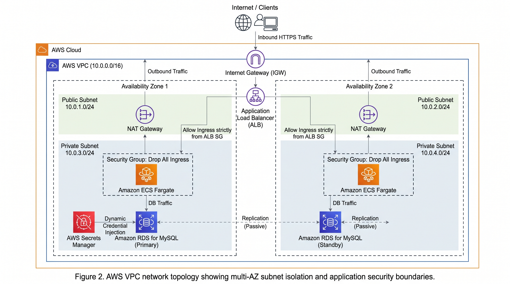
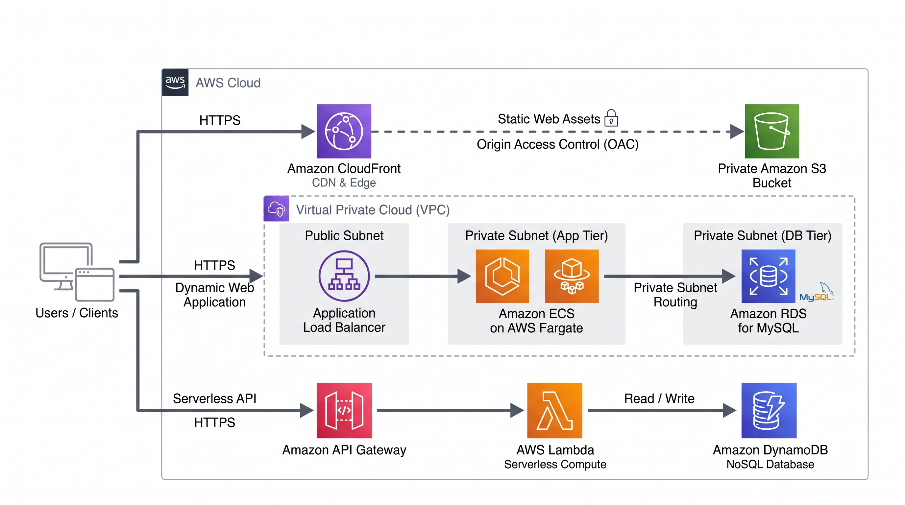
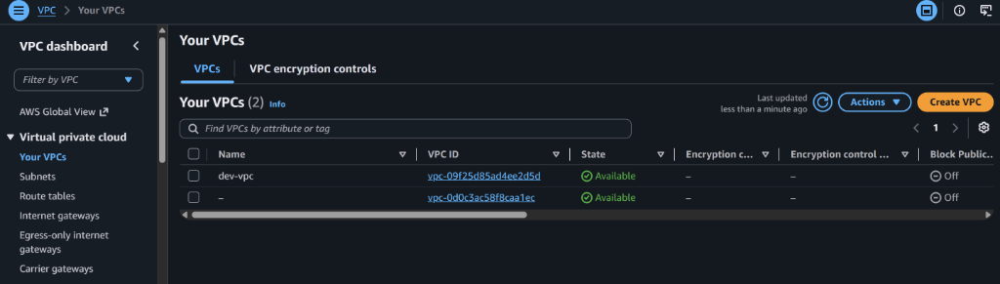
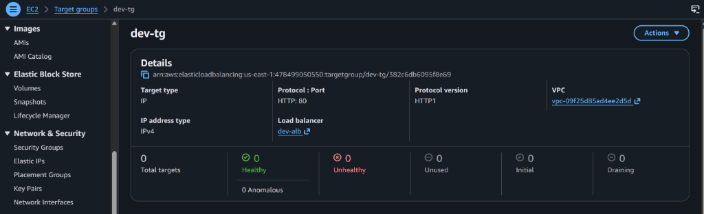
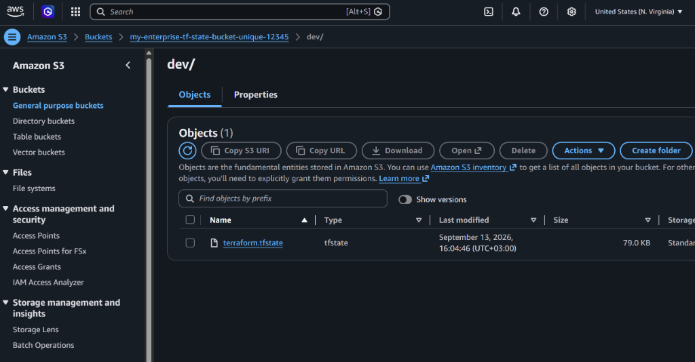
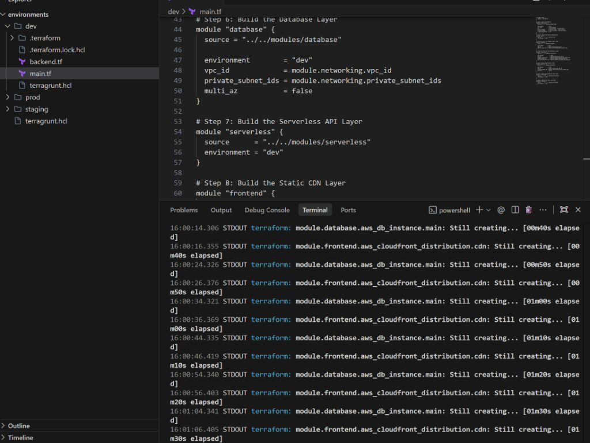

# Enterprise AWS Multi-Environment Infrastructure Platform

[](https://github.com/adeliusa486/terraform-aws-multi-env-platform/actions/workflows/validation.yml)

This repository contains the complete Infrastructure as Code (IaC) implementation for a highly available, modular, and secure AWS environment. The project is designed to transition legacy, manually configured infrastructure (ClickOps) into a deterministic, version-controlled architecture managed by Terraform and Terragrunt.

The infrastructure follows strict enterprise engineering standards, focusing on high availability, network isolation, Zero-Trust security models, and dynamic secret management.

---

## 1. High-Level System Architecture

The overarching architecture is split into three primary traffic flows: static asset delivery at the edge, a dynamic containerized application tier, and an event-driven serverless API tier.

<p align="center">
  
</p>

### Traffic Routing
*   **Static Assets**: Client requests for static content are routed through Amazon CloudFront, which serves cached assets from Edge Locations globally to minimize latency.
*   **Dynamic Application**: Client HTTP requests are terminated at the Application Load Balancer (ALB). The ALB inspects the packets and routes them securely into the private subnets to the ECS Fargate cluster.
*   **Serverless Microservices**: Specific API calls are routed through Amazon API Gateway, which triggers short-lived AWS Lambda functions that interact with DynamoDB.

---

## 2. Network Topology and Isolation

The foundational layer of this platform is the Virtual Private Cloud (VPC), which establishes the physical network boundaries and routing rules.

<p align="center">
  
</p>

### Subnet Design
The network is distributed across multiple Availability Zones to ensure fault tolerance.
*   **Public Subnets (DMZ)**: These subnets are attached to the Internet Gateway. They host the Application Load Balancer and NAT Gateways. No application compute resources are permitted in these subnets.
*   **Private Subnets**: These subnets have no direct route to the internet. They host the ECS Fargate containers and RDS database instances. Outbound internet access (required for pulling Docker images or system updates) is routed through the NAT Gateway located in the public subnet.

### Cost Optimization vs. High Availability
Because NAT Gateways incur hourly charges, the networking module is highly parameterized. 
*   In the **Development** environment, the `single_nat_gateway` variable is set to true. All private subnets share a single NAT Gateway, drastically reducing monthly costs.
*   In the **Production** environment, this variable is disabled, forcing Terraform to provision a redundant NAT Gateway in every single Availability Zone. This ensures that the loss of an entire AWS data center will not sever outbound internet access for the remaining application instances.

---

## 3. Compute and Zero-Trust Security

The compute layer abandons traditional EC2 virtual machines in favor of AWS Fargate, a serverless container orchestrator. This eliminates the operational overhead of patching host operating systems and managing instance scaling.

### Stateful Security Groups (Zero-Trust)
Security Groups act as stateful virtual firewalls attached directly to the Elastic Network Interfaces (ENIs) of the containers. 
This architecture enforces a strict Zero-Trust model:
*   The **ALB Security Group** permits ingress traffic from the public internet (0.0.0.0/0) on Port 80/443.
*   The **ECS Security Group** explicitly drops all public internet traffic. It contains a single ingress rule that only accepts packets originating from the exact ID of the ALB Security Group. 
This guarantees that an attacker cannot bypass the load balancer to communicate directly with the application containers.

---

## 4. Relational Database and Secrets Management

The data tier utilizes Amazon RDS for MySQL. The database instances are placed deep within the private subnets and are completely inaccessible from the outside world.

### Dynamic Credential Injection
A critical security flaw in many infrastructure projects is hardcoding database passwords into variable files (`.tfvars`) or leaving them visible in the Terraform state file.
This platform solves this by utilizing Terraform's cryptographic `random_password` provider. 
1. During deployment, a 16-character complex string is generated completely in memory.
2. This string is injected directly into AWS Secrets Manager.
3. The RDS instance references the Secrets Manager vault for its master password.
No human engineer ever sees the password, and it is never committed to Git.

### Active/Standby Replication
The `database` module accepts a `multi_az` boolean variable. When enabled in Production, AWS provisions a primary database instance in AZ 1, and a synchronous standby replica in AZ 2. If the primary hardware fails, AWS automatically updates the DNS CNAME to point to the standby instance, resulting in automated failover with zero data loss.

---

## 5. Global Edge Delivery (CDN)

Static content is hosted in an Amazon S3 bucket, but the bucket's public access policies are strictly blocked. 

To serve this content globally with low latency, an Amazon CloudFront distribution is deployed. To ensure users cannot bypass the CDN and access the S3 bucket directly, we configured an **Origin Access Control (OAC)** policy. CloudFront uses this policy to cryptographically sign every request it makes to S3. The S3 bucket policy is configured to only allow `s3:GetObject` actions if the request contains a valid OAC signature from our specific CloudFront distribution.

---

## 6. Automated State Management (Terragrunt)

Managing state files across multiple environments (Dev, Staging, Prod) using raw Terraform requires heavily duplicated backend configuration blocks. This violates the DRY (Don't Repeat Yourself) principle and introduces the risk of state corruption if an engineer forgets to update a backend key.

This repository utilizes **Terragrunt** to dynamically inject backend configurations at runtime.
*   **Amazon S3**: Acts as a highly available, encrypted storage vault for the `terraform.tfstate` files.
*   **Amazon DynamoDB**: Acts as a state locking mechanism. If two engineers attempt to run `terragrunt apply` simultaneously, DynamoDB grants an exclusive lock to the first request and forces the second request to wait, guaranteeing state file integrity.

---

## 7. Operational Proof of Deployment

The following captures demonstrate the successful execution and physical provisioning of the modular code contained in this repository.

<table>
  <tr>
    <td align="center">
      <br>
      <b>AWS Console: VPC and Subnet Provisioning</b>
    </td>
    <td align="center">
      <br>
      <b>AWS Console: Load Balancer Target Group</b>
    </td>
  </tr>
  <tr>
    <td align="center">
      <br>
      <b>AWS Console: S3 Remote State Bucket</b>
    </td>
    <td align="center">
      <br>
      <b>Terminal: Automated Terraform Execution</b>
    </td>
  </tr>
</table>

---

## 8. Deployment Guide

To provision this infrastructure, ensure you have the AWS CLI, Terraform, and Terragrunt installed.

### Prerequisites
Authenticate your terminal with an AWS IAM User that possesses administrative privileges.
```bash
aws configure
```

### Execution Steps
1. Navigate to the desired environment directory:
```bash
cd environments/dev
```
2. Initialize the remote state backend. Terragrunt will automatically build the S3 bucket and DynamoDB table.
```bash
terragrunt init
```
3. Generate the execution plan to review the architectural changes:
```bash
terragrunt plan
```
4. Provision the infrastructure:
```bash
terragrunt apply
```

**Cost Control Warning**: To avoid unnecessary hourly charges for the Application Load Balancer, NAT Gateway, and RDS instances, always destroy the environment when testing is complete:
```bash
terragrunt destroy
```
